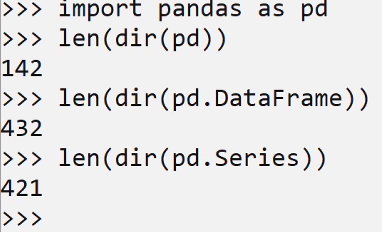

two types of data - noSql - xml/json
sal data - 2D -csv/DB/...
# 2D -rows * cols aggregation
Pandas have very comprehension IO
can read csv,html,xl many binary big data formats

pandas api need to learn new terminalogy
2D called dataframe - which is list of columns are also called series(1D)

import pandas as pd
it have a lots of api
might already installed pandas modules

advantage is very good documentation
it has formal cheatsheet
learn pandas require 4-5 hours needed
not all apis need to learn - few subset of apis are sufficient
learn from cheat sheet

https://pandas.pydata.org/Pandas_Cheat_Sheet.pdf

####
Open CSV file : C:\Users\varri\IdeaProjects\python-basics\python_basics_22July_2024\python_advanced_01082024\Day2\iris.csv